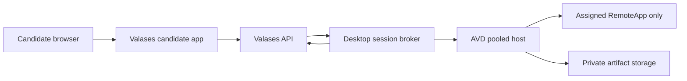

# Windows Desktop Assessment Cutover

## Target architecture

Use Azure Virtual Desktop (AVD) pooled host pools and publish Excel, QuickBooks, and
Drake Tax as RemoteApps. Keep each candidate in a separate Windows user session and
give each assessment issue a private working directory. If vendor compatibility
requires different Windows images, use separate host pools for each application.

The Valases API remains the source of truth for candidate identity, assessment
entitlement, time limits, session state, and submitted artifacts. The Windows broker
receives only a pseudonymous candidate reference and the issued-assessment ID.



## Isolation requirements

- Create one Windows user session per issued assessment. Never share an interactive
  Windows session between candidates.
- Use the server-generated `workspace_key` for a private assessment workspace. Clone
  only that assessment's template files into it.
- Do not use candidate names or email addresses in Windows usernames, host logs, or
  storage paths. Use the broker-provided pseudonymous reference.
- Publish only the assigned RemoteApp. Do not expose the Windows desktop, shell,
  Task Manager, Control Panel, browser, or file explorer.
- Disable clipboard, local drive, printer, USB, COM-port, and smart-card redirection
  unless a specific assessment requires one and security approves it.
- Restrict host egress to Windows/application licensing, Valases broker endpoints,
  private artifact storage, monitoring, and approved vendor services.
- Encrypt traffic and storage. Keep session recordings or screenshots disabled
  unless the assessment notice, consent, and retention policy explicitly cover them.
- Upload the final working file to private storage, calculate SHA-256, notify the
  Valases API, then remove the Windows profile and workspace after the retention
  window.

## Broker API contract

Configure the Valases API to call an HTTPS broker. Every request uses:

```http
Authorization: Bearer <DESKTOP_SESSION_BROKER_TOKEN>
Content-Type: application/json
```

The broker implements:

| Method | Path | Purpose |
| --- | --- | --- |
| `POST` | `/v1/sessions` | Allocate an isolated user session and assigned RemoteApp |
| `POST` | `/v1/sessions/{provider_session_id}/launch` | Return a short-lived browser launch URL |
| `POST` | `/v1/sessions/{provider_session_id}/heartbeat` | Renew/report the active lease |
| `POST` | `/v1/sessions/{provider_session_id}/finalize` | Save artifacts, sign out, and clean up |

Session creation receives:

```json
{
  "client_session_id": "Valases UUID",
  "assessment_issue_id": 123,
  "candidate_ref": "pseudonymous HMAC value",
  "app_key": "excel",
  "provider_application_id": "avd-remoteapp-id",
  "workspace_key": "assessment-issue-123-random",
  "duration_seconds": 5400,
  "isolation": "windows_user_session",
  "allowed_application_only": true
}
```

Return `provider_session_id`, `host_id`, `lease_expires_at`, and a short-lived
`launch_url`. Launch URLs must use the exact origin configured in
`DESKTOP_SESSION_GATEWAY_ORIGIN`. Do not return a general AVD portal or full-desktop
URL.

For asynchronous state changes, the broker calls:

```http
POST /desktop-sessions/broker/events
Authorization: Bearer <DESKTOP_SESSION_BROKER_TOKEN>
```

Artifacts use private `azure://` or `s3://` URIs, SHA-256, size, and a stable
artifact key. The API stores metadata, not application files.

## Capacity and reliability

- Start with breadth-first load balancing so sessions spread across healthy hosts.
- Set the host-pool maximum session limit from measured application memory/CPU use,
  not the Windows maximum.
- Required hosts =
  `ceil(peak concurrent candidates / tested sessions per host) + one failover host`.
- Autoscaling must start hosts before scheduled assessment peaks. Do not depend on a
  cold host becoming available after a candidate signs in.
- Load test each app separately and then test the expected mixed workload.
- Alert on broker allocation latency, launch failures, heartbeat gaps, host
  saturation, artifact upload failure, and sessions left in `finalize_pending`.
- Schedule an internal call to
  `POST /desktop-sessions/operations/reconcile` for expired or interrupted sessions.

## Licensing gates

- Excel: use a Microsoft 365 plan that supports shared computer activation. Each
  user accessing Office on the shared host needs an eligible license and account.
- QuickBooks Desktop: confirm the selected edition, number of concurrent users,
  hosting rights, Windows Server compatibility, and RDS CAL requirements with
  Intuit or an authorized hosting provider.
- Drake Tax: obtain written confirmation for the planned concurrent-user,
  terminal-server, and hosted-assessment use before enabling it.
- Record the approval or contract reference in
  `DESKTOP_LICENSE_ATTESTATIONS_JSON`. Valases fails closed when an app mapping or
  license attestation is missing.

## Environment configuration

Set these server-side variables on both regional API projects. Do not add them to
the candidate Vite project except for the existing public API base URL.

```dotenv
ENABLE_DESKTOP_APP_SESSIONS=true
DESKTOP_SESSION_BROKER_MODE=http
DESKTOP_SESSION_BROKER_URL=https://broker.example.com
DESKTOP_SESSION_BROKER_TOKEN=<at-least-32-random-characters>
DESKTOP_SESSION_GATEWAY_ORIGIN=https://apps.example.com
DESKTOP_SESSION_TIMEOUT_SECONDS=10800
DESKTOP_SESSION_HEARTBEAT_SECONDS=30
DESKTOP_APP_ASSIGNMENTS_JSON={"spreadsheet":"excel","accounting":"quickbooks","tax_simulator":"drake_tax"}
DESKTOP_APP_CATALOG_JSON={"excel":{"display_name":"Microsoft Excel","provider_application_id":"excel-remoteapp","enabled":true},"quickbooks":{"display_name":"QuickBooks Desktop","provider_application_id":"quickbooks-remoteapp","enabled":true},"drake_tax":{"display_name":"Drake Tax","provider_application_id":"drake-remoteapp","enabled":true}}
DESKTOP_LICENSE_ATTESTATIONS_JSON={"excel":{"approved":true,"reference":"license-record-id"},"quickbooks":{"approved":true,"reference":"license-record-id"},"drake_tax":{"approved":true,"reference":"license-record-id"}}
```

## One-day cutover

1. Run `deploy/sql/20260728_desktop_app_sessions.sql` in both Tokyo and Mumbai
   Supabase SQL Editors.
2. Build or validate the hardened Windows images and install licensed applications.
3. Publish each application as a RemoteApp and register its provider application ID.
4. Deploy the broker and gateway on HTTPS with monitoring and private storage access.
5. Add the environment variables with `ENABLE_DESKTOP_APP_SESSIONS=false`.
6. Deploy the Valases API and candidate app.
7. Check `/health`, the launch-readiness report, and Settings > Assessment apps.
8. Test one candidate per app, then at least three concurrent candidates using the
   same app. Verify separate Windows sessions, workspaces, and artifacts.
9. Confirm submission, expiry, revocation, and proctor termination all finalize the
   correct session.
10. Set `ENABLE_DESKTOP_APP_SESSIONS=true` and redeploy the regional APIs.

Rollback is immediate: set `ENABLE_DESKTOP_APP_SESSIONS=false` and redeploy. Existing
session records and artifacts remain available for audit and reconciliation.
